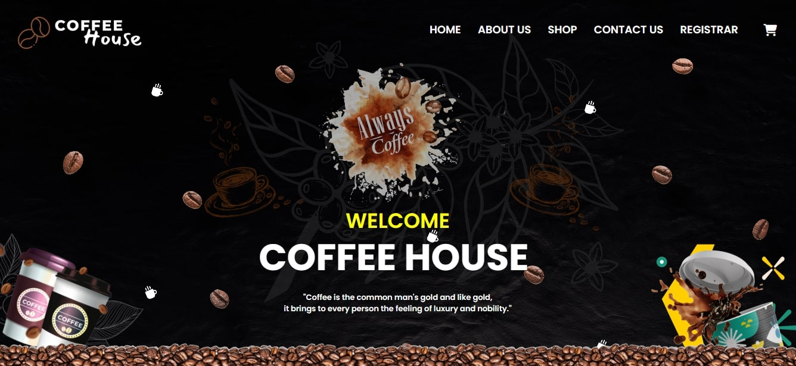

<h3 align="center">
  ✨ COM 2303 - Web Design Mini Project ✨
</h3>

  

<ul>
        <li><strong>Front Page Elegance:</strong> Welcome users with a visually captivating landing page that exudes the aroma and warmth of a cozy coffee house.</li>
        <li><strong>Interactive Menu:</strong> Present an interactive menu featuring a variety of coffee blends, espresso drinks, pastries, and other offerings. Utilize CSS for appealing design and organization.</li>
        <li><strong>Smooth Navigation:</strong> Implement smooth navigation throughout the website using JavaScript to enhance user experience, ensuring easy access to different sections of the site.</li>
        <li><strong>Responsive Design:</strong> Employ responsive design techniques using CSS to ensure the website looks great and functions seamlessly across various devices, including desktops, tablets, and mobile phones.</li>
        <li><strong>Online Ordering:</strong> Incorporate JavaScript functionalities to enable users to place online orders directly from the website, making the ordering process convenient and efficient.</li>
        <li><strong>Engaging Content:</strong> Provide informative content about coffee origins, brewing techniques, and tasting notes to engage users and enhance their appreciation for coffee.</li>
        <li><strong>Event Promotion:</strong> Use HTML and CSS to create dedicated sections for promoting events such as live music performances, art exhibitions, or coffee tasting sessions hosted at the coffee house.</li>
        <li><strong>Social Media Integration:</strong> Integrate social media buttons and feeds using JavaScript to encourage users to share their experiences and follow the coffee house on various social platforms.</li>
        <li><strong>Feedback Mechanism:</strong> Implement a feedback mechanism using JavaScript forms to gather customer feedback and improve the quality of service provided by the coffee house.</li>
        <li><strong>Community Interaction:</strong> Foster a sense of community by including a blog section where users can read and contribute articles related to coffee culture, recipes, and personal experiences.</li>
    </ul>

